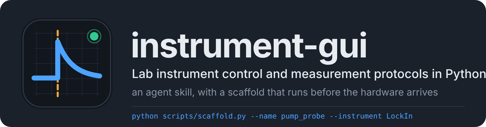
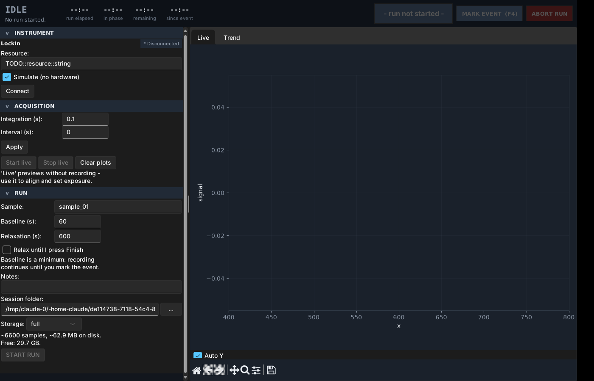

<div align="center">



<p>
<a href="LICENSE"></a>

<a href="https://github.com/ljx-chase/instrument-gui/stargazers"></a>

</p>

<strong>Language</strong>: <a href="README.md">English</a> | <a href="README.zh-CN.md">中文</a>

</div>

> **Ask an AI for an instrument-control program and you get a window that
> runs, freezes on the first long exposure, and saves data nobody can
> reproduce a month later.** This skill tells the agent how a measurement
> application differs from a normal one: hardware never sits on the UI
> thread, every run is reproducible from its own folder, and the operator
> can abort without losing data. A scaffold gets the program running and
> its tests passing before the hardware arrives.

It is an agent skill: Claude Code, Codex, Cursor and anything else that reads
`SKILL.md` can use it. The scaffold is plain Python and works with no agent.

If it helps you, a ⭐ makes it easier for others to find. Every rule in here
comes from something that went wrong in my own lab, so the sample is small;
try it on your instrument and tell me where it is wrong.

## Contents

- [Quick start](#quick-start)
- [Why this exists](#why-this-exists)
- [Without it / with it](#without-it--with-it)
- [What the agent actually gets](#what-the-agent-actually-gets)
- [The scaffold](#the-scaffold)
- [What the generated app looks like](#what-the-generated-app-looks-like)
- [What the data looks like](#what-the-data-looks-like)
- [Scope: what it covers and what it does not](#scope-what-it-covers-and-what-it-does-not)
- [Why Tkinter, and Qt](#why-tkinter-and-qt)
- [Repository structure](#repository-structure)
- [Design principles](#design-principles)
- [Evals](#evals)
- [Roadmap](#roadmap)
- [Changelog](#changelog)
- [Contributing and feedback](#contributing-and-feedback)
- [License](#license)

## Quick start

If your agent can reach GitHub, paste this:

```text
Install the instrument-gui skill from
https://github.com/ljx-chase/instrument-gui, following the installation
section of the repo's AGENTS.md.
```

Or by hand, per platform.

**Claude Code**, one line:

```bash
npx skills add ljx-chase/instrument-gui -g
```

or copy the `instrument-gui/` folder into `~/.claude/skills/`. Drop the `-g`,
or use `.claude/skills/` inside a project, to scope it to that project; a
project-scoped copy ships with the repo, so everyone in the lab who clones it
has the skill.

**Claude apps (claude.ai, desktop, Cowork)** do not read `~/.claude/skills/`.
Download the zip from [releases](https://github.com/ljx-chase/instrument-gui/releases)
and upload it under Customize, then Skills. The zip must contain a single
folder named `instrument-gui` with `SKILL.md` at its top level.

**Codex or another repository-aware agent**: clone the repo into the
workspace and keep `AGENTS.md` at the root. It tells the agent when to load
the skill.

**Anything else**: hand `instrument-gui/SKILL.md` to the agent as its
instruction file; references and scripts are read when it points at them.

Then try:

```text
We have a Keithley 2450 source meter on the bench, USB, pyvisa connects.
Write me an app: set start, stop and step voltage, hit go, it sweeps and
plots I-V live, and saves every sweep separately. The samples are thin
films, compliance current must be settable.
```

A correct first move runs the scaffold, gets the app running in simulate
mode, and only then writes the 2450's SCPI; compliance is treated as a
safety setting (set before the output is enabled, output off on exit). If
it starts writing a 500-line window class from a blank file, the skill did
not load.

**No agent, scaffold only:**

```bash
python instrument-gui/scripts/scaffold.py --name iv_sweep --instrument Keithley2450 --dest .
python iv_sweep_app.py --simulate      # runs immediately, no hardware
python tests/test_iv_sweep.py          # headless, passes immediately
```

## Why this exists

Measurement software sits in an odd place. It owns hardware that can be
slow, can hang and can damage a sample; it produces data that must still be
interpretable a year later; and it is operated by someone whose hands are
busy. LabVIEW has stayed the default for decades not because graphical
programming is pleasant but because it makes you handle these things: the
driver lives in its own loop, the UI is not blocked by the hardware, data
carries timestamps.

People now write these in Python with an AI. The code comes out, but the
agent writes it to the standard of an ordinary desktop app:

- `driver.read()` inside a button callback. Fine at 100 ms exposure; at 8 s
  the window is dead, the operator cannot tell frozen from crashed and
  reaches for the power switch.
- Tk widgets touched from a worker thread. Tkinter is not thread-safe; the
  symptom is a random crash three hours into a run.
- Form values read during the run. The later frames were measured with
  settings `protocol.json` does not mention, and the person reconciling that
  three months later is you.
- Derived quantities saved (absorbance, phase) instead of raw counts plus the
  dark frame. When the correction turns out to be wrong, the data cannot be
  recomputed.
- `ax.clear()` and a full replot every frame, `savez_compressed` on noisy
  floats. At 20 ms per sample the per-frame work exceeds the interval, the
  queue grows, the app slowly stops responding.

None of this is the model not knowing. Nobody told it this was a measurement
program. The skill tells it, in a form that can be checked: one rule, five
non-negotiables, a failure table, a shipping checklist, and a scaffold that
writes the correct skeleton first.

## Without it / with it

### Without it

> **You:** Write me a GUI for our spectrometer, live spectrum and saving.
>
> **Agent:** Here is a complete program using Tkinter and matplotlib...
> *(One 400-line file. `Spectrometer` and `App` in the same class,
> `read_spectrum()` called directly in the `after()` callback, `ax.clear()`
> every frame, a Save button that dumps the current array to a CSV named
> by timestamp, integration time not recorded.)*
>
> **You:** It freezes when I set integration time to 5 s.
>
> **Agent:** The read is blocking the main thread. We can add a thread...
> *(Adds a thread that calls `self.label.config(...)` from inside it.)*

### With it

> **You:** Write me a GUI for our spectrometer, live spectrum and saving.
>
> **Agent:** Skeleton first, running in simulate mode, then the real hardware.
>
> ```
> python scripts/scaffold.py --name spectrum --instrument CCS200 --dest .
> python spectrum_app.py --simulate      # running
> python tests/test_spectrum.py          # 3/3 passed
> ```
>
> The scaffold's driver is a placeholder. The CCS200 uses Thorlabs' TLCCS
> DLL; I have written `connect / configure / read / close` as ctypes calls
> against its header, with each status bit's meaning in a comment citing
> `TLCCS.h`. The simulator models lamp spectrum times sample transmission
> plus dark current and noise, so the absorbance chain is actually tested
> rather than fed a ready-made curve.
>
> One thing I could not resolve: the manual gives 10 µs as the minimum
> integration time but the DLL notes say below 1 ms is unsupported. I left a
> `TODO` on that constant rather than guess.
>
> At run start every setting goes to `protocol.json` and the form freezes;
> raw counts per frame, dark and reference once per session; every sample
> carries its phase and elapsed-time columns. Abort keeps the data and marks
> it `aborted`.
>
> Not done: I do not have your spectrometer, so the DLL calls never run in
> simulate mode. With hardware attached, try `Connect` without `--simulate`
> first and read the status bar.

*The difference is not the amount of code. It is the order (something that
runs and is tested exists before the hardware is the only unknown), and that
it says what it did not do instead of shipping placeholders as finished.*

## What the agent actually gets

`SKILL.md` is under 150 lines; full text in
[instrument-gui/SKILL.md](instrument-gui/SKILL.md). Four layers.

### One rule

**The Tk thread owns the UI. Worker threads own the hardware. They meet
only at a queue.**

```
  hardware            worker thread                 Tk thread
 ┌────────┐   blocking   ┌──────────┐   queue.Queue  ┌──────────────┐
 │ driver │◄────────────►│ acquire  │───────────────►│ root.after() │──► plots
 │        │   calls      │   loop   │   (data +      │  drain loop  │──► logger
 └────────┘              └──────────┘    status)     └──────────────┘──► widgets
```

Everything else in the skill is that diagram plus the realities of lab work.

### Five non-negotiables, with reasons

1. **Every driver gets a simulator twin.** Same method names, same return
   types, plausible physics. It lets the GUI be developed without occupying
   the instrument, tests run headlessly, and the operator rehearse before
   committing a sample. Model the measurement chain so the *derived*
   quantities are exercised: a lamp and a sample, not a ready-made
   absorbance curve.
2. **Snapshot the protocol at run start; never read the form during a run.**
   Write everything to `protocol.json`, read parameters from the snapshot,
   disable the widgets that fed it.
3. **Log raw, derive later.** Store what the instrument returned plus the
   calibration needed to reduce it. Dark frame, reference, gain: once per
   session. Reduction pipelines change; raw counts do not.
4. **Record phase and timing on every sample.** Which phase, seconds since
   run start, seconds since each operator mark, and a flag for samples whose
   integration window straddled a boundary.
5. **Separate the measurement clock from the wall clock.** Analysis wants
   "seconds since the thing happened". Compute it at acquisition time and
   store it as a column.

### A failure table

| Symptom | Cause | Fix |
|---|---|---|
| App stutters, falls behind, freezes | Per-sample work exceeds the drain interval | Profile acquire → derive → log → draw |
| Window frozen during long exposures | Driver called on the Tk thread | Move it to a worker |
| Headless test hangs in `root.update()` | Same overload, now unbounded | Bounded pump |
| Compressed saves eat the frame budget | `savez_compressed` on noisy floats | Plain `savez` |
| Heatmap is one flat colour | A few bad pixels own the range | Percentile limits |
| Derived quantity has huge spikes | Dividing by a near-zero calibration pixel | Propagate NaN |
| Data cannot be reproduced | Settings changed mid-run, or never recorded | Snapshot |

Each one is expanded in a reference file.

### A shipping checklist

Nine items the agent must pass before saying it is done, among them: no
`NotImplementedError` or scaffold `TODO` left in the driver for the named
instrument, either implemented against its documentation or flagged as
unresolved; runs end to end in simulate mode; a headless test drives a full
protocol and asserts the output files; nothing on the Tk thread blocks longer
than one drain interval; an unplugged instrument is a message, not a hang;
abort keeps data and is distinguishable from completion; a frame's worth of
work fits in the shortest sample period; a README for whoever analyses the
data.

## The scaffold

```bash
python instrument-gui/scripts/scaffold.py --name pump_probe --instrument LockIn --dest .
```

Twelve files:

```
pump_probe_app.py            entry point: root, theme, window, --simulate flag
gui/pump_probe_window.py     all Tk; owns the drain loop; no hardware calls
gui/theme.py                 ttk style + matplotlib rcParams, applied once
gui/widgets.py               collapsible sections, scrollable frame, status dot, toolbar recolour
instruments/lockin.py        driver + simulator + acquisition worker; no Tk
pump_probe_protocol.py       phase state machine; no Tk, no hardware
pump_probe_logging.py        session writer; no Tk, no hardware
tests/test_pump_probe.py     headless: phase machine, boundary contamination, end-to-end run
README_pump_probe.md         for whoever analyses the data
```

The three "no Tk, no hardware" modules are where the physics lives and they
test in milliseconds. Keep physics out of the window class.

```bash
python pump_probe_app.py --simulate      # runs immediately
python tests/test_pump_probe.py          # 3/3 passed
```

Then search the generated files for `TODO`. Mainly two places:

| File | What |
|---|---|
| `instruments/lockin.py` | `connect / configure / read / close`; make the simulator model your measurement chain |
| `gui/pump_probe_window.py` | `_derive()`, i.e. the physics; axis labels; pre-flight checks |

Running the scaffold twice in one project is safe: shared files
(`gui/theme.py`, `gui/widgets.py`) are kept, so a second instrument can sit
beside the first. `--force` replaces them.

**Requirements**: Python 3.9+, `numpy`, `matplotlib`, `tkinter` (bundled
with most Python installs; on Debian/Ubuntu `sudo apt install python3-tk`).
Optional: `pip install sv-ttk` for a modern dark theme; the app falls back to
a hand-styled theme without it.

### What the scaffold is and is not

The generated protocol (baseline, operator-marked event, relaxation) and
data shape (one 512-point trace per sample) are **examples**, the same
whatever `--instrument` name you pass. A scaffolded app that passes its own
tests proves the wiring; it knows nothing about your instrument until the
driver speaks its real protocol and the simulator models what it really
measures. `SKILL.md` makes the agent finish that part or say explicitly that
it could not.

A free-running monitor with no protocol uses the same scaffold: collapse the
phases to the ones you need rather than removing the machine the window is
built around.

## What the generated app looks like

<p align="center">
  
</p>

Status header across the top: state word, clocks, the one next-action
button, abort at the far right, readable from across the room. Collapsible
control column on the left, Live and Trend plots on the right. The window
never changes shape during a run: phase changes alter text and colour, not
which widgets exist.

**F2** always performs the next step; **F4** timestamps a free-text note at
any time. The phase marks are deliberately not behind a confirmation dialog,
because their whole point is the timestamp.

The theming lessons are in
[references/look-and-feel.md](instrument-gui/references/look-and-feel.md):
a dated-looking Tk app is usually four specific defects (stock ttk widgets,
fonts that do not exist on the machine, the matplotlib toolbar ignoring the
style, no spacing system), each with a fix, all already in the templates.

## What the data looks like

```
<out>/pump_probe_session_YYYYmmdd_HHMMSS_<sample>/
    session_info.txt     human-readable header: what, when, settings
    protocol.json        every setting at run start
    calibration.npz      dark, reference, gain: once per session
    index.csv            one row per sample: phase, elapsed times, file, boundary flag
    samples/*.npz        raw, uncompressed
    derived.csv          derived scalars, recomputable from the above
    phase_log.csv        entry and exit timestamp of every phase
    events.csv           operator marks and notes
    run_summary.json     status: complete or aborted
```

`status` matters: a truncated run must not be read as a plateau.

## Scope: what it covers and what it does not

**Covered now**: one instrument (or a few loosely coupled ones), a linear
timed protocol (baseline / event / relaxation, anneal ramps and holds, a
simple single-parameter sweep), software timing (milliseconds and up),
open-loop acquisition, one operator, data that must be reproducible. A lot of
everyday lab work has this shape: time-resolved pump-probe, in-situ
monitoring during an anneal, I-V sweeps, long stability logs.

**Not covered, which is the gap to LabVIEW**:

- **Multi-instrument orchestration.** The scaffold is one driver, one
  worker. A stage plus a laser plus a spectrometer plus a lock-in with
  dependencies and a shared clock has no "instrument manager" layer here.
- **A sweep engine.** The phase machine is a timeline, not nested loops.
  "Sweep X, at each X sweep Y, at each point measure Z" is the agent's own
  code for now.
- **Hardware timing and triggering.** DAQmx-style hardware-clocked
  acquisition, microsecond timing, FPGA. A Python software loop cannot do
  it and the skill does not pretend to.
- **Feedback control.** PID temperature control, autofocus. The worker loop
  is open-loop acquisition.
- **A driver library.** None included; the agent writes against the manual
  or wraps [pymeasure](https://github.com/pymeasure/pymeasure)'s.

If your need falls there, [bluesky](https://blueskyproject.io/) (a
beamline-grade run engine), [PyMoDAQ](https://pymodaq.cnrs.fr/) (modular DAQ
explicitly positioned against LabVIEW, PyQt) and
[pymeasure](https://github.com/pymeasure/pymeasure) (Procedure plus window)
are mature, and having the agent build on them is more sensible than
scaffolding from scratch. What this skill contributes that they do not is the
discipline (thread rule, snapshot, raw logging, phase labels), which holds
inside those frameworks too and is exactly what an agent forgets when it
writes without one.

## Why Tkinter, and Qt

Tkinter is already on every lab PC, needs no compiler and no package
manager, and is enough for a control column plus a couple of live plots.
Everything in the skill except the widget code (threading, drivers, logging,
phase machine, tests) is toolkit-independent.

If you need dockable panels, image streams above ~10 fps, or the lab already
runs on Qt, use Qt; no theme fixes Tk for those.
[references/qt.md](instrument-gui/references/qt.md) maps each pattern:
`root.after` becomes `QTimer`, the queue can stay as is (easier to test than
signals, and the worker module is byte-for-byte identical), matplotlib
becomes `FigureCanvasQTAgg` or `pyqtgraph`, headless tests use
`QT_QPA_PLATFORM=offscreen` with no X server. The scaffold generates Tk only;
its non-GUI files are reusable under Qt as-is.

## Repository structure

```
instrument-gui/                       the skill; copy this folder
    SKILL.md                          architecture, non-negotiables, failure table, checklist
    references/
        architecture.md               layers, threading, queue protocol, phase machines, mixins
        instrument-drivers.md         driver/simulator contract, transport libraries, warm-up, watchdogs
        data-logging.md               session layout, formats, flush cadence, write-cost budget
        live-plotting.md              redraw throttling, drawing only what is visible, decimation, colour scales, NaN
        operator-safety.md            irreversible runs, pre-flight, freezing inputs, abort vs finish, emergency stop
        testing.md                    headless end-to-end tests, the bounded pump, screenshot checks
        look-and-feel.md              the four Tk defects and their fixes, colour rules for operators
        qt.md                         the same architecture in PyQt/PySide
    scripts/scaffold.py               generates a runnable skeleton
    evals/                            benchmark prompts, incl. a deliberately broken app
AGENTS.md                             agent entrypoint: how to install, how to behave
docs/                                 logo, icon, screenshot
README.md / README.zh-CN.md
LICENSE                               MIT
```

## Design principles

- **Running first, hardware last.** Start from a simulated app that runs;
  you are always one step from a thing that works and the hardware is the
  only unknown. Start from a blank file and the first run is also the
  instrument's first involvement; when it breaks you do not know which half.
- **Non-negotiables carry their reasons.** Each rule is a real incident
  written down, so the agent knows when an exception is not acceptable.
- **Checkable, not persuadable.** Every checklist item either runs or is
  visible in a file. "The driver is written" does not count; "no
  `NotImplementedError` in the driver" does.
- **Say what was not done.** A command that cannot be found gets a marked
  stub, not a guess.
- **References on demand.** `SKILL.md` stays short; each reference is
  self-contained and read when building that part.

## Evals

`evals/evals.json` holds the three prompts and assertions the skill was
tuned against:

| | Scenario | Checks |
|---|---|---|
| 0 | Keithley 2450 I-V sweep app | thread, queue, simulator, per-sweep files, compliance as a safety setting, output off on exit |
| 1 | TC300 anneal protocol | explicit phase machine, per-sample phase and elapsed columns, phase log, snapshot, complete vs aborted |
| 2 | Fix a photodiode logger that freezes at 20 ms | names the blocking read on the Tk thread, explains why shorter intervals make it worse, `savez_compressed`, `ax.clear()` |

`evals/fixtures/photodiode_monitor.py` is the deliberately broken app for
scenario 2. To benchmark a modified version or add scenarios, start there.

## Roadmap

In the order I will need them myself:

1. **A sweep engine.** A `Sweep` abstraction beside the phase machine:
   nested parameter loops, acquisition per point, resume after interruption.
   Rotational-anisotropy Raman ("rotate, acquire a spectrum, repeat") does
   not fit the scaffold today.
2. **Multiple instruments.** A driver registry and shared clock, several
   workers reporting to one drain.
3. **A Qt scaffold.** `--toolkit qt`, reusing the non-GUI templates.
4. **An installable core.** Every app currently carries its own copy of the
   logging and protocol code; a pip package would leave the scaffold
   generating only the instrument-specific parts.

## Changelog

### v1.0.0

- First public release.
- `SKILL.md`: one rule, five non-negotiables, failure table, shipping
  checklist.
- Eight references.
- Scaffold: 12-file runnable skeleton with headless tests; optional `sv_ttk`
  theme, per-platform fonts, matplotlib toolbar recolour.
- Three evals and one deliberately broken fixture.

## Contributing and feedback

The most useful feedback: **try it on your own instrument and tell me which
rule is wrong for your case.** My sample is a few devices in an optics lab;
electrical, cryogenic and vacuum setups have failure modes I may not have
met.

In an issue, include the instrument, the agent and model, and roughly what
its first response looked like. For a PR, change files under
`instrument-gui/` and say which eval validates the change.

## License

MIT.
