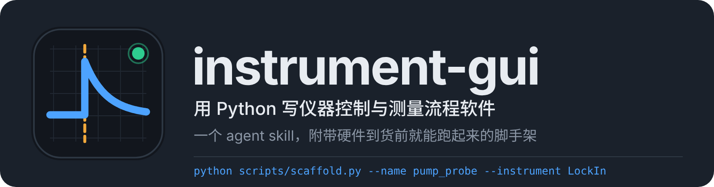

<div align="center">



<p>
<a href="LICENSE"></a>

<a href="https://github.com/ljx-chase/instrument-gui/stargazers"></a>

</p>

<strong>语言</strong>: <a href="README.md">English</a> | <a href="README.zh-CN.md">中文</a>

</div>

> **让 AI 写一个仪器控制程序，它会给你一个能跑的窗口，然后在第一次长曝光时卡死，
> 数据存成一个月后没人能复现的格式。** 这个 skill 把测量软件和普通软件的区别讲给 agent
> 听：硬件永远不在界面线程上、每次运行都从自己的文件夹就能复现、操作员随时能中止而不丢数据。
> 附带一个脚手架，硬件没到货之前程序就已经在跑、测试就已经在过。

这是一个 agent skill，Claude Code、Codex、Cursor 以及任何能读 `SKILL.md` 的 agent 都能用。
脚手架脚本是纯 Python，不装 agent 也能单独用。

觉得有用的话点个 ⭐。这个 skill 目前的所有规则都来自我自己实验室里踩过的坑，
样本不大，欢迎用你的仪器来试，然后告诉我哪里不对。

## 目录

- [快速开始](#快速开始)
- [为什么会有这个](#为什么会有这个)
- [没有它 / 有它](#没有它--有它)
- [它到底给 agent 什么](#它到底给-agent-什么)
- [脚手架](#脚手架)
- [生成的程序长什么样](#生成的程序长什么样)
- [数据存成什么样](#数据存成什么样)
- [适用范围：能做什么，不能做什么](#适用范围能做什么不能做什么)
- [为什么是 Tkinter，以及 Qt](#为什么是-tkinter以及-qt)
- [仓库结构](#仓库结构)
- [设计原则](#设计原则)
- [Evals](#evals)
- [路线图](#路线图)
- [更新记录](#更新记录)
- [贡献与反馈](#贡献与反馈)
- [许可证](#许可证)

## 快速开始

如果你的 agent 能访问 GitHub，直接把这句话发给它：

```text
安装 instrument-gui skill：
https://github.com/ljx-chase/instrument-gui
按照仓库 AGENTS.md 的 Installation 部分完成安装并验证。
```

也可以按平台手动装。

**Claude Code** — 一条命令：

```bash
npx skills add ljx-chase/instrument-gui -g
```

或者把 `instrument-gui/` 文件夹复制到 `~/.claude/skills/`。去掉 `-g`、或者改放到项目里的
`.claude/skills/`，就只在那个项目生效。放在项目里的好处是跟着仓库走，实验室里谁 clone 了都有。

**Claude 客户端（claude.ai、桌面端、Cowork）** — 这些不读 `~/.claude/skills/`。
从 [releases](https://github.com/ljx-chase/instrument-gui/releases) 下载 zip，在 Customize 的
Skills 里上传。zip 里必须是一个叫 `instrument-gui` 的文件夹、`SKILL.md` 在它的顶层。

**Codex 或其他能读仓库的 agent** — 把仓库 clone 进工作区，`AGENTS.md` 留在根目录，它会告诉
agent 什么时候加载。

**其他情况** — 直接把 `instrument-gui/SKILL.md` 当指令文件给 agent，references 和 scripts
在它指向的时候再读。

装好后试一句：

```text
我们桌上有台 Keithley 2450 源表，USB 接的，pyvisa 能连上。给我写个程序：
设起始电压、终止电压、步长，点开始就扫一遍，边扫边画 I-V，每次扫描单独存文件。
样品是薄膜，限流一定要能设。
```

正确的第一反应是先跑脚手架、在模拟模式下把程序跑起来、再去写 2450 的 SCPI；
限流会被当成安全参数而不是普通设置：输出打开前先设限流，退出时关输出。
如果它直接从空白文件开始写一个 500 行的窗口类，说明 skill 没装上。

**不用 agent，只用脚手架**：

```bash
python instrument-gui/scripts/scaffold.py --name iv_sweep --instrument Keithley2450 --dest .
python iv_sweep_app.py --simulate      # 没有硬件也立刻能跑
python tests/test_iv_sweep.py          # 无头测试，立刻能过
```

## 为什么会有这个

实验室里的测量软件有一个很特殊的处境：它控制的硬件可能很慢、可能挂死、可能毁掉样品；它产生的
数据一年后还得能看懂；用它的人两只手都在忙别的。LabVIEW 之所以几十年来一直是默认选择，
不是因为图形编程好用，而是因为它把这些事替你想好了：驱动在自己的循环里跑、界面不会被硬件
卡住、数据有时间戳。

现在很多人改用 Python 加 AI 写。代码确实能出来，但 agent 默认是按"普通桌面程序"的标准在写：

- 把 `driver.read()` 直接放在按钮回调里。曝光 100 ms 时没问题，调到 8 s 窗口就死了，
  操作员分不清是卡住还是崩溃，伸手去按电源。
- 从 worker 线程里直接改 Tk 控件。Tkinter 不是线程安全的，表现是跑了三个小时之后随机崩一次。
- 运行中还在读表单里的值。后半段的数据是用改过的参数测的，而 `protocol.json` 里写的是开始时的。
  三个月后对数据的人是你自己。
- 存的是算过的量（吸光度、相位差），不存原始计数和当时的暗帧。后来发现校正公式有问题，
  数据没法重算。
- 每一帧 `ax.clear()` 再重画、`savez_compressed` 存噪声浮点数。20 ms 采样间隔下每帧的工作量超过
  间隔本身，队列越堆越长，程序慢慢失去响应。

这些都不是模型"不会"，而是没人告诉它这是一个测量程序。这个 skill 就是把这件事告诉它，
而且是用能被检查的方式：一条规则、五条不可妥协的要求、一张故障表、一份交付前的清单，
以及一个把正确的骨架先写好的脚手架。

## 没有它 / 有它

### 没有它

> **你：** 给我写个 GUI 控制我们的光谱仪，要能实时看光谱、能存数据。
>
> **Agent：** 好的，下面是一个使用 Tkinter 和 matplotlib 的完整程序……
> *（一个 400 行的文件：`Spectrometer` 类和 `App` 类写在一起，`read_spectrum()` 在
> `after()` 回调里直接调用，每帧 `ax.clear()` 重画，"保存"按钮把当前数组存成一个 CSV，
> 文件名是时间戳，没有记录积分时间。）*
>
> **你：** 积分时间设到 5 秒窗口就卡住了。
>
> **Agent：** 这是因为读取阻塞了主线程。可以加一个线程……
> *（加了线程，线程里直接 `self.label.config(...)`。）*

### 有它

> **你：** 给我写个 GUI 控制我们的光谱仪，要能实时看光谱、能存数据。
>
> **Agent：** 先生成骨架，在模拟模式下跑通，再接真实硬件。
>
> ```
> python scripts/scaffold.py --name spectrum --instrument CCS200 --dest .
> python spectrum_app.py --simulate      # 跑起来了
> python tests/test_spectrum.py          # 3/3 通过
> ```
>
> 骨架里的驱动是占位的。CCS200 用 Thorlabs 的 TLCCS DLL，我按它的头文件把
> `connect / configure / read / close` 写成 ctypes 调用，状态位的含义写在注释里，
> 引用自 `TLCCS.h`。模拟器模拟的是灯谱乘以样品透过率加暗电流和噪声，这样吸光度那条计算链
> 是真的被测试到的，而不是直接吐一条现成的曲线。
>
> 有一个没查到：`tlccs_setIntegrationTime` 的最小值在手册里写的是 10 µs，但 DLL 文档
> 说 1 ms 以下不保证。我留了一个 `TODO` 标记在常数那里，没有猜。
>
> 运行时所有设置写进 `protocol.json`，表单冻结；每一帧存原始计数，暗帧和参考谱一个 session
> 存一次；每个样本带相位标签和相对时间列。中止保留数据并标记 `aborted`。
>
> 还没做的：你的光谱仪型号我没有，这些 DLL 调用在模拟模式下跑不到。接上硬件后先跑
> `--simulate` 以外的 `Connect`，看状态栏的连接消息。

*区别不在代码量，在于顺序：先有一个能跑能测的东西，硬件是最后接进去的唯一未知数；
以及它说清楚了自己没做到的部分，而不是把占位代码当成品交出来。*

## 它到底给 agent 什么

`SKILL.md` 本身不到 200 行，完整文本在
[instrument-gui/SKILL.md](instrument-gui/SKILL.md)。它的内容分四层。

### 一条规则

**Tk 线程管界面，worker 线程管硬件，两者只在队列相遇。**

```
  硬件              worker 线程                 Tk 线程
 ┌────────┐  阻塞    ┌──────────┐  queue.Queue  ┌──────────────┐
 │ driver │◄────────►│ acquire  │──────────────►│ root.after() │──► 图
 │        │  调用    │   loop   │  (数据+状态)   │  drain loop  │──► 日志
 └────────┘          └──────────┘               └──────────────┘──► 控件
```

skill 里的其他一切都是这条规则加上实验室现实推出来的结果。

### 五条不可妥协的要求，以及为什么

1. **每个驱动都有一个模拟器双胞胎。** 同样的方法名、同样的返回类型、说得过去的物理。
   这不是锦上添花：它让 GUI 可以在不占仪器的时候开发、让测试可以在 CI 里无头跑、
   让操作员可以在上真样品前先排练一遍流程。模拟器要有足够的物理，让*导出量*算得对：
   程序算吸光度，模拟器就该模拟灯和样品，而不是直接给一条吸光度曲线，否则整条校正链都没被测到。
2. **运行开始时快照协议，运行中绝不读表单。** 开始时把所有设置写进 `protocol.json`，
   运行代码从快照读参数，然后把表单控件冻结。
3. **存原始量，事后再算。** 存仪器实际返回的东西，加上还原它需要的校准。暗帧、参考谱、增益，
   一个 session 存一次而不是每帧存一次。还原流程会变，原始计数不会。
4. **每个样本都记相位和时间。** 属于哪个相位、距运行开始多少秒、距每个操作员标记多少秒，
   以及一个标记：积分窗口是否跨了相位边界。分析永远需要选"变化前的"和"变化后的"，
   一半一半的样本哪边都不属于。
5. **测量时钟和墙上时钟分开。** 分析想要的通常是"事件发生后多少秒"而不是时间戳。
   采集时就从记录的标记算出来，存成一列。

### 一张故障表

| 症状 | 原因 | 修法 |
|---|---|---|
| 程序卡顿、落后、最后冻住 | 每个样本的工作量超过了 drain 间隔 | 分别测 acquire → derive → log → draw 的耗时 |
| 长曝光时窗口冻结 | 驱动在 Tk 线程上被调用 | 挪到 worker |
| 无头测试在 `root.update()` 里永远挂着 | 同上，现在没有上限了 | 有界 pump |
| 压缩保存吃掉帧预算 | 对噪声浮点数用 `savez_compressed` | 换 `savez` |
| 热图一片单色 | 几个坏像素决定了 min/max | 用百分位定范围 |
| 导出量有巨大尖峰 | 除以了接近零的校准像素 | 传播 NaN |
| 数据无法复现 | 运行中改了设置，或者根本没记 | 快照 |

每一条在 references 里都有展开。

### 一份交付前的清单

agent 说"做完了"之前要过的九项，包括：驱动里没有留下 `NotImplementedError` 或脚手架的
`TODO`，要么按文档实现了，要么明确告诉用户没解决；模拟模式下端到端能跑；无头测试跑完整
流程并断言输出文件；Tk 线程上没有任何东西会阻塞超过一个 drain 间隔；拔掉仪器表现为一条消息
而不是挂死；中止保留数据并与完成区分开；量过一帧的工作量能放进最短采样周期；有一份面向分析
数据的人的 README。

## 脚手架

```bash
python instrument-gui/scripts/scaffold.py --name pump_probe --instrument LockIn --dest .
```

生成 12 个文件：

```
pump_probe_app.py            入口：建 root、套主题、构造窗口、--simulate 开关
gui/pump_probe_window.py     所有 Tk 代码；drain loop 在这里；不碰硬件
gui/theme.py                 ttk 样式 + matplotlib rcParams，启动时套一次
gui/widgets.py               可折叠分区、可滚动框架、状态灯、工具栏调色
instruments/lockin.py        驱动 + 模拟器 + 采集 worker 线程；不碰 Tk
pump_probe_protocol.py       相位状态机；不碰 Tk，不碰硬件
pump_probe_logging.py        session 写入器；不碰 Tk，不碰硬件
tests/test_pump_probe.py     无头测试：状态机、边界污染、端到端模拟运行
README_pump_probe.md         给分析数据的人看的
```

三个"不碰 Tk 不碰硬件"的模块是物理所在的地方，毫秒级就能测完。窗口类里不要堆物理。

```bash
python pump_probe_app.py --simulate      # 立刻能跑
python tests/test_pump_probe.py          # 3/3 通过
```

然后在生成的文件里搜 `TODO`，那些是需要你真实硬件调用和真实物理的地方。主要两处：

| 文件 | 要改什么 |
|---|---|
| `instruments/lockin.py` | `connect / configure / read / close`；让模拟器模拟你的测量链 |
| `gui/pump_probe_window.py` | `_derive()`，也就是物理；坐标轴标签；预检项 |

同一个项目里跑两次脚手架是安全的：共享文件（`gui/theme.py`、`gui/widgets.py`）会被保留，
所以第二台仪器可以和第一台并排生成。`--force` 才会覆盖。

**要求**：Python 3.9+，`numpy`，`matplotlib`，`tkinter`（大多数 Python 自带；Debian/Ubuntu 上
`sudo apt install python3-tk`）。可选：`pip install sv-ttk`，现代深色主题，没装会退回手写主题。

### 脚手架是什么，不是什么

生成的协议（基线 → 操作员标记事件 → 弛豫）和数据形状（每个样本一条 512 点的曲线）是**示例**，
不管 `--instrument` 传什么名字都一样。一个过了自己测试的脚手架程序证明的是接线没问题，
它对你的仪器一无所知，直到驱动真的说那台仪器的协议、模拟器真的模拟它测的东西。`SKILL.md`
要求 agent 把这部分做完，或者明确说做不到，而不是把占位代码当成品。

自由运行的监视程序（没有协议）也用同一个脚手架：把相位折叠成你需要的那几个，而不是把状态机
删掉，窗口是围着它建的。

## 生成的程序长什么样

<p align="center">
  
</p>

顶部状态栏：状态词、几个计时器、一个"下一步"按钮、最右边中止。隔着房间能看清。
左边是可折叠的控制列，右边是 Live / Trend 两个图。运行中窗口不会变形：相位变化时改的是文字和颜色，
不会有控件出现或消失。

**F2** 永远执行下一步，**F4** 在任何时候给一条自由文本加时间戳。两个相位标记故意不放确认框，
因为它们的意义就是那个时间戳。

主题这块踩过的坑写在 [references/look-and-feel.md](instrument-gui/references/look-and-feel.md)：
Tk 程序看起来老气通常就是四个具体原因（原生 ttk 控件、不存在的字体、matplotlib 工具栏不吃样式、
没有间距系统），每个都有对应的修法，并且都已经写进脚手架模板。

## 数据存成什么样

```
<out>/pump_probe_session_YYYYmmdd_HHMMSS_<sample>/
    session_info.txt     给人看的头：测的什么、什么时候、什么设置
    protocol.json        运行开始时的全部设置快照
    calibration.npz      暗帧、参考谱、增益：一个 session 一次
    index.csv            每个样本一行：相位、相对时间、文件名、边界标记
    samples/*.npz        原始量，不压缩
    derived.csv          导出量，可以随时从上面重算
    phase_log.csv        每个相位的进入和退出时间戳
    events.csv           操作员的标记和注释
    run_summary.json     status: complete 或 aborted
```

`run_summary.json` 里的 `status` 很重要：一次被截断的运行不能被读成一个平台期。

## 适用范围：能做什么，不能做什么

说清楚比说大话有用。

**它现在覆盖的是**：一台（或少数几台松耦合的）仪器、一条线性的时间协议（基线 / 事件 / 弛豫，
或者退火的升温 / 保温 / 降温，或者简单的单参数扫描）、软件定时（毫秒级及以上）、开环采集、
一个人操作、数据必须可复现。实验室里大量日常测量就是这个形状：时间分辨的泵浦探测、退火过程
的原位监测、I-V 扫描、长时间稳定性记录。

**它现在不覆盖的，也就是离 LabVIEW 还差的**：

- **多仪器编排。** 脚手架是一个 driver、一个 worker。位移台 + 激光 + 光谱仪 + 锁相要协同、
  有依赖关系、共用一个时钟，skill 里没有"仪器管理器"这一层。
- **参数扫描引擎。** 相位状态机是一条时间线，不是嵌套循环。"扫 X，每个 X 下扫 Y，每个点测 Z"
  目前靠 agent 自己写。
- **硬件定时和触发。** DAQmx 那种硬件时钟的同步采集、µs 级的时序、FPGA，Python 的软件循环
  做不到，这个 skill 也不假装能做。
- **反馈控制。** PID 温控、自动对焦这种闭环，worker 循环现在是开环采集。
- **驱动库。** 不带任何驱动，靠 agent 对着手册写，或者包一层
  [pymeasure](https://github.com/pymeasure/pymeasure) 的现成驱动。

如果你的需求落在后面这几条里，
[bluesky](https://blueskyproject.io/)（同步辐射线站级别的运行引擎）、
[PyMoDAQ](https://pymodaq.cnrs.fr/)（明确对标 LabVIEW 的模块化 DAQ，PyQt）、
[pymeasure](https://github.com/pymeasure/pymeasure)（Procedure + 窗口）已经是成熟方案，
让 agent 在它们之上写比从脚手架从头写更合理。这个 skill 真正独特的部分是那套纪律
（线程规则、快照、存原始量、相位标签），它们在这些框架里也成立，而且恰恰是 agent 不用框架
自己写时最容易忘的。

## 为什么是 Tkinter，以及 Qt

Tkinter 已经在每台实验室电脑上了，不需要编译器也不需要包管理器，做一列控件加两张实时图足够。
skill 里除了控件代码之外的一切（线程、驱动、日志、状态机、测试）都和 GUI 框架无关。

要可停靠面板、要高帧率图像流（>10 fps）、实验室已经一水 Qt 程序，那就该用 Qt，换主题救不了 Tk。
[references/qt.md](instrument-gui/references/qt.md) 给了逐项映射：`root.after` 换 `QTimer`，
队列可以原样保留（比 signal 好测，而且 worker 模块两边一字不差），matplotlib 换
`FigureCanvasQTAgg` 或者 `pyqtgraph`，无头测试用 `QT_QPA_PLATFORM=offscreen`，连 xvfb 都不用。
脚手架目前只生成 Tk；它生成的非 GUI 文件在 Qt 下可以直接复用。

## 仓库结构

```
instrument-gui/                       skill 本体，复制这个文件夹
    SKILL.md                          架构、不可妥协的要求、故障表、清单
    references/
        architecture.md               分层、线程、队列协议、相位状态机、用 mixin 拼大窗口
        instrument-drivers.md         驱动/模拟器契约、传输库选择、预热样本、运行中重配置、看门狗
        data-logging.md               session 目录、文件格式、刷盘节奏、写入成本预算
        live-plotting.md              重绘节流、只画可见的、抽稀、色标、NaN
        operator-safety.md            不可重复的运行、预检、冻结输入、中止 vs 完成、紧急停止
        testing.md                    无头端到端测试、有界 pump、模拟器支撑的验证、截图检查
        look-and-feel.md              Tk 看起来老气的四个原因和修法、操作员用的颜色规则
        qt.md                         同一套架构在 PyQt/PySide 里怎么写
    scripts/scaffold.py               生成可运行的骨架
    evals/                            benchmark 用的提示词，含一个故意写坏的程序
AGENTS.md                             agent 的入口：怎么装、装完怎么做
docs/                                 logo、icon、截图
README.md / README.zh-CN.md
LICENSE                               MIT
```

## 设计原则

- **先有能跑的，再接硬件。** 从一个模拟模式下在跑的程序出发，离"能用"永远只差一步，硬件
  是唯一的未知数。从空文件出发，第一次跑起来的时候也是仪器第一次参与，坏了不知道是哪半边。
- **不可妥协的要求要带理由。** 每条规则后面都是一个真实的事故，写出来 agent 才知道什么时候
  例外是不行的。
- **可检查，不可糊弄。** 清单里的每一项要么能跑出来，要么能在文件里找到。"驱动写好了"不算，
  "驱动里没有 `NotImplementedError`"才算。
- **说清楚没做到的。** 查不到的命令留标记，不猜。
- **references 按需读。** `SKILL.md` 保持短，每个 reference 自成一体，建哪部分读哪份。

## Evals

`evals/evals.json` 是这个 skill 调试时用的三个提示词和对应断言：

| | 场景 | 考察 |
|---|---|---|
| 0 | Keithley 2450 I-V 扫描程序 | 线程、队列、模拟器、每次扫描单独存、限流作为安全设置、退出关输出 |
| 1 | TC300 温控器退火协议 | 显式相位状态机、每个样本带相位和相对时间、相位日志、快照、完成 vs 中止 |
| 2 | 修一个 20 ms 下会冻结的光电二极管记录程序 | 指出 Tk 线程上的阻塞读取、解释为什么间隔越短越糟、`savez_compressed`、`ax.clear()` |

`evals/fixtures/photodiode_monitor.py` 是第 2 条用的那个故意写坏的程序，故障表里的几个典型错误都在里面。
想测自己改过的版本，或者加新场景，从这里开始。

## 路线图

按我自己接下来会用到的顺序：

1. **扫描引擎。** 一个和相位状态机并列的 `Sweep` 抽象：嵌套参数循环、每个点的采集、
   断点续扫。旋转各向异性 Raman 这种"转角度、每个角度采谱"的实验现在还不贴合脚手架。
2. **多仪器。** 一个 driver 注册表和共享时钟，几个 worker 向同一个 drain 汇报。
3. **Qt 脚手架。** `--toolkit qt`，复用现有的非 GUI 模板。
4. **可安装的核心包。** 现在每个程序都复制一份 logging 和 protocol 代码；抽成一个 pip 包，
   脚手架只生成仪器特定的部分。

## 更新记录

### v1.0.0

- 首个公开版本。
- `SKILL.md`：一条规则、五条不可妥协的要求、故障表、交付清单。
- 八份 references。
- 脚手架：12 个文件的可运行骨架，含无头测试；`sv_ttk` 可选主题、按平台选字体、matplotlib
  工具栏调色。
- 三个 evals 和一个故意写坏的 fixture。

## 贡献与反馈

最有用的反馈是：**用你自己的仪器试一次，告诉我哪条规则在你的情况下是错的。** 我的样本是
光学实验室的几台设备，电学、低温、真空那边的坑我不一定踩过。

提 issue 的时候带上：仪器型号、agent 和模型、它生成的第一个回复大概长什么样。
PR 请改 `instrument-gui/` 下的文件并说明哪个 eval 验证了改动。

## 许可证

MIT。
